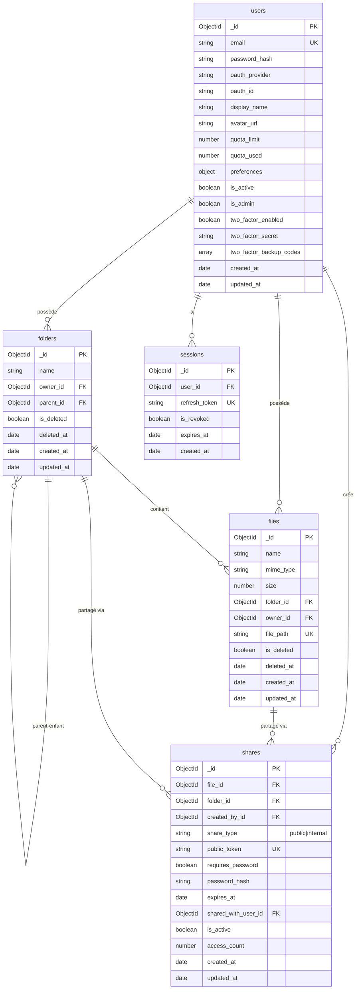

# Diagrammes UML – SUPFile

Ce document contient les diagrammes demandés pour la documentation technique : **cas d’utilisation** et **schéma relationnel / logique de la base de données**. Ils sont décrits en **Mermaid** (affichables sur GitHub, GitLab et dans de nombreux outils).

---

## 1. Diagramme de cas d’utilisation (Use Case)

Les acteurs et les cas d’usage principaux du système.

```mermaid
flowchart TB
    subgraph Acteurs
        A1[Utilisateur non inscrit]
        A2[Utilisateur inscrit]
        A3[Administrateur]
    end

    subgraph Cas_d_usage_publics
        UC1[Accéder à un lien public partagé]
        UC2[Télécharger fichier/dossier via lien]
    end

    subgraph Authentification
        UC3[S'inscrire]
        UC4[Se connecter email/mot de passe]
        UC5[Se connecter OAuth2 Google/GitHub]
        UC6[Mot de passe oublié]
        UC7[Activer / gérer 2FA]
    end

    subgraph Espace_personnel
        UC8[Accéder au tableau de bord]
        UC9[Gérer fichiers et dossiers]
        UC10[Prévisualiser fichiers]
        UC11[Partager fichier/dossier]
        UC12[Rechercher et filtrer]
        UC13[Modifier paramètres]
        UC14[Corbeille et restauration]
    end

    subgraph Administration
        UC15[Gérer utilisateurs]
        UC16[Consulter statistiques]
    end

    A1 --> UC1
    A1 --> UC2
    A2 --> UC3
    A2 --> UC4
    A2 --> UC5
    A2 --> UC6
    A2 --> UC7
    A2 --> UC8
    A2 --> UC9
    A2 --> UC10
    A2 --> UC11
    A2 --> UC12
    A2 --> UC13
    A2 --> UC14
    A3 --> UC15
    A3 --> UC16
    A2 --> UC8
    UC8 --> UC9
    UC8 --> UC10
```

### Légende des cas d’usage

| Id  | Cas d’usage | Description |
|-----|-------------|-------------|
| UC1 | Accéder à un lien public partagé | Ouvrir une URL de partage (sans compte) |
| UC2 | Télécharger via lien | Télécharger un fichier ou un dossier (ZIP) via le lien public |
| UC3 | S’inscrire | Créer un compte (email + mot de passe) |
| UC4 | Se connecter (email/mdp) | Connexion classique |
| UC5 | Se connecter OAuth2 | Connexion avec Google ou GitHub |
| UC6 | Mot de passe oublié | Demande et réinitialisation par email |
| UC7 | 2FA | Activer / désactiver double authentification (TOTP) |
| UC8 | Tableau de bord | Vue quota, répartition, fichiers récents |
| UC9 | Gérer fichiers/dossiers | Créer, renommer, déplacer, supprimer, upload, download |
| UC10 | Prévisualiser | Images, PDF, texte, audio/vidéo en streaming |
| UC11 | Partager | Lien public (optionnel : mot de passe, expiration) ou partage avec un utilisateur |
| UC12 | Rechercher et filtrer | Recherche par nom/extension, filtres par type et date |
| UC13 | Paramètres | Profil, avatar, email, mot de passe, thème, langue |
| UC14 | Corbeille | Consulter la corbeille, restaurer ou purger |
| UC15 | Gérer utilisateurs | Administration des comptes (admin) |
| UC16 | Statistiques | Tableau de bord admin (stats globales) |

---

## 2. Schéma relationnel / logique de la base de données

Le projet utilise **MongoDB** ; la structure logique est décrite sous forme de **schéma relationnel** (entités et relations) équivalent aux collections MongoDB.

### 2.1 Diagramme entité-association (logique)

### 2.2 Relations et cardinalités

| Entité source | Relation | Entité cible | Cardinalité | Description |
|---------------|----------|--------------|-------------|-------------|
| users | possède | folders | 1:N | Un utilisateur a plusieurs dossiers |
| users | possède | files | 1:N | Un utilisateur a plusieurs fichiers |
| users | crée | shares | 1:N | Un utilisateur crée plusieurs partages |
| users | a | sessions | 1:N | Un utilisateur peut avoir plusieurs sessions (refresh tokens) |
| folders | parent-enfant | folders | 1:N | Un dossier peut avoir des sous-dossiers |
| folders | contient | files | 1:N | Un dossier contient plusieurs fichiers |
| files | partagé via | shares | 1:N | Un fichier peut avoir plusieurs partages |
| folders | partagé via | shares | 1:N | Un dossier peut avoir plusieurs partages |

### 2.3 Correspondance MongoDB

- **users** → collection `users`
- **folders** → collection `folders` (références `owner_id`, `parent_id` en ObjectId)
- **files** → collection `files` (références `folder_id`, `owner_id` ; `file_path` unique)
- **shares** → collection `shares` (références `file_id`, `folder_id`, `created_by_id`, `shared_with_user_id`)
- **sessions** → collection `sessions` (référence `user_id`)

Les fichiers binaires ne sont **pas** stockés dans MongoDB ; ils sont sur le système de fichiers (volume Docker `/uploads`). Seul le chemin (`file_path`) est en BDD.

---

## 3. Architecture de l’API (endpoints principaux)

Pour le détail des routes et paramètres, voir **`docs/API.md`**. Résumé des groupes d’endpoints :

| Préfixe | Description |
|---------|-------------|
| `POST /api/auth/signup` | Inscription |
| `POST /api/auth/login` | Connexion |
| `POST /api/auth/refresh` | Rafraîchir le token |
| `GET/PATCH /api/auth/me` | Profil utilisateur |
| `POST /api/auth/forgot-password` | Mot de passe oublié |
| `POST /api/auth/reset-password` | Réinitialisation mot de passe |
| `GET /api/folders` | Lister dossiers (racine ou enfants) |
| `POST /api/folders` | Créer dossier |
| `PATCH /api/folders/:id` | Renommer / déplacer dossier |
| `DELETE /api/folders/:id` | Supprimer dossier |
| `POST /api/files/upload` | Upload fichier(s) |
| `GET /api/files` | Lister fichiers d’un dossier |
| `GET /api/files/:id/download` | Télécharger |
| `GET /api/files/:id/preview` | Prévisualisation (image, PDF, texte) |
| `GET /api/files/:id/stream` | Streaming audio/vidéo |
| `PATCH /api/files/:id` | Renommer / déplacer |
| `DELETE /api/files/:id` | Supprimer (corbeille) |
| `GET/POST /api/trash` | Corbeille (liste, restaurer, purger) |
| `POST /api/share/public` | Créer partage public |
| `GET /api/share/:token` | Accès lien public |
| `POST /api/share/internal` | Partager avec un utilisateur |
| `GET /api/search` | Recherche unifiée + filtres |
| `GET /api/dashboard` | Tableau de bord (quota, répartition, récents) |
| `GET /api/admin/*` | Routes administration (rôle admin) |

---

Document créé : Décembre 2025
