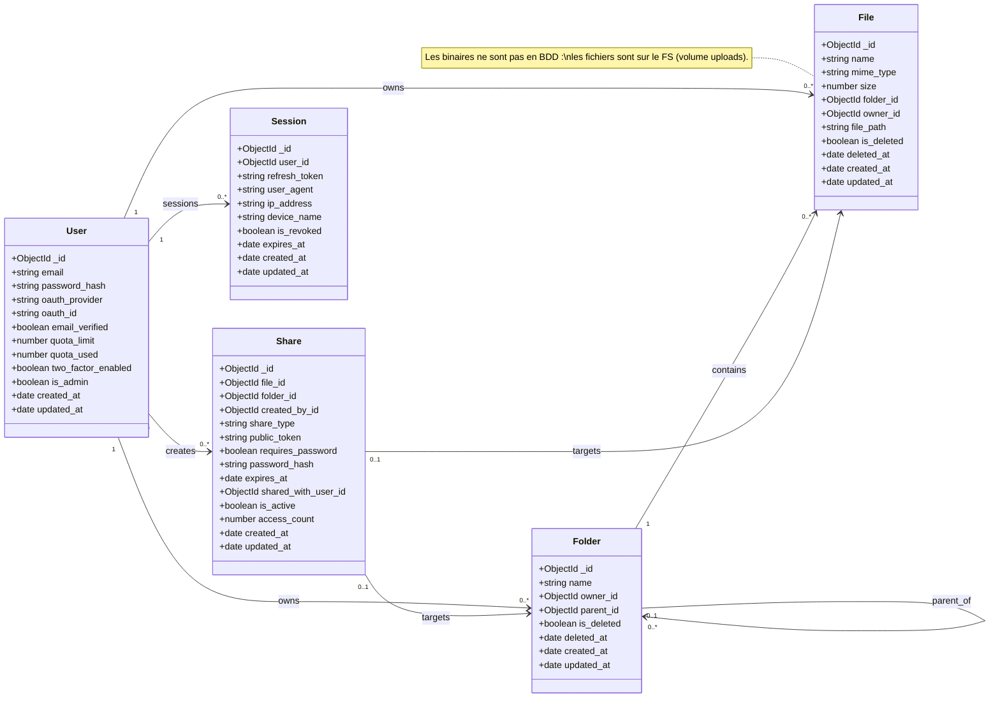
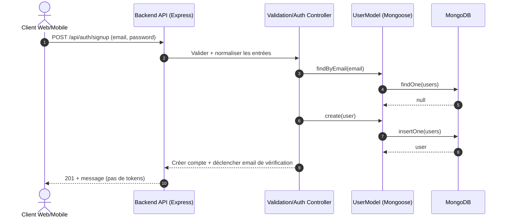
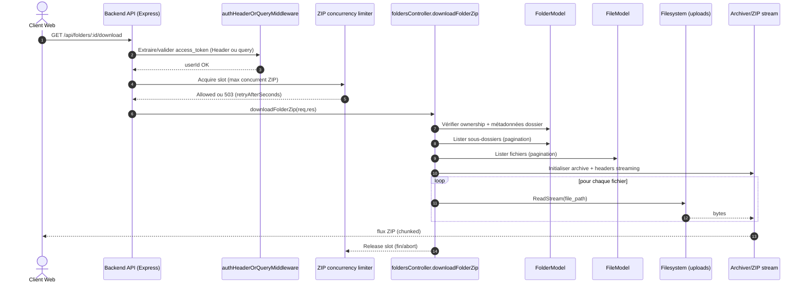

# Diagrammes UML – SUPFile

Ce document contient les diagrammes demandés pour la documentation technique :
- **Diagramme de cas d’utilisation**
- **Diagramme de classes** (modèle métier + relations)
- **Diagrammes de séquence** (scénarios clés)
- **Schéma logique de la base de données** (collections MongoDB)

Ils sont décrits en **Mermaid** (affichables sur GitHub, GitLab et dans de nombreux outils).

---

## 1. Diagramme de cas d’utilisation (Use Case)

Ce diagramme est volontairement **plus simple à lire** :
- Les **acteurs** sont à gauche.
- Les cas d’usage sont dans la boîte **SUPFile (Système)**.
- Les flèches en pointillés `inclut` montrent qu’un cas d’usage en **contient** un autre (ex. « Gérer fichiers & dossiers » inclut upload/download/preview).

### 1.1 Vue simplifiée (recommandée)

```mermaid
flowchart LR
    classDef actor fill:#ffffff,stroke:#333,stroke-width:1px;
    classDef uc fill:#f6f8ff,stroke:#4b6cff,stroke-width:1px;

    A1[Utilisateur non inscrit]:::actor
    A2[Utilisateur inscrit]:::actor
    A3[Administrateur]:::actor

    subgraph SYS[SUPFile (Système)]
        direction TB

        subgraph PUB[Accès public]
            UC_LINK([Ouvrir un lien public]):::uc
            UC_LINK_DL([Télécharger via lien]):::uc
            UC_LINK_PREV([Prévisualiser via lien]):::uc
        end

        subgraph AUTH[Authentification]
            UC_SIGNUP([S’inscrire + vérifier e-mail]):::uc
            UC_LOGIN([Se connecter (email/mdp)]):::uc
            UC_OAUTH([Se connecter OAuth2 (Google/GitHub)]):::uc
            UC_RESET([Mot de passe oublié / réinitialiser]):::uc
            UC_2FA([Activer / gérer 2FA]):::uc
        end

        subgraph CORE[Espace personnel]
            UC_DASH([Tableau de bord]):::uc
            UC_FILES([Gérer fichiers & dossiers]):::uc
            UC_UPLOAD([Uploader]):::uc
            UC_DOWNLOAD([Télécharger (fichier / dossier ZIP)]):::uc
            UC_PREVIEW([Prévisualiser / streamer]):::uc
            UC_SHARE([Partager (public / interne)]):::uc
            UC_SEARCH([Rechercher & filtrer]):::uc
            UC_TRASH([Corbeille / restaurer / purge]):::uc
            UC_SETTINGS([Paramètres du compte]):::uc
        end

        subgraph ADM[Administration]
            UC_USERS([Gérer utilisateurs]):::uc
            UC_STATS([Consulter statistiques]):::uc
        end

        UC_FILES -.->|inclut| UC_UPLOAD
        UC_FILES -.->|inclut| UC_DOWNLOAD
        UC_FILES -.->|inclut| UC_PREVIEW

        UC_SHARE -.->|génère| UC_LINK
        UC_LINK -.->|permet| UC_LINK_DL
        UC_LINK -.->|permet| UC_LINK_PREV
    end

    A1 --> UC_LINK
    A1 --> UC_SIGNUP
    A1 --> UC_LOGIN
    A1 --> UC_OAUTH
    A1 --> UC_RESET

    A2 --> UC_DASH
    A2 --> UC_FILES
    A2 --> UC_SHARE
    A2 --> UC_SEARCH
    A2 --> UC_TRASH
    A2 --> UC_SETTINGS
    A2 --> UC_2FA

    A3 --> UC_USERS
    A3 --> UC_STATS
```

### 1.2 Détail des cas d’usage (en clair)

**Accès public (sans compte)**
- Ouvrir un lien public de partage
- Prévisualiser / télécharger via ce lien (si mot de passe requis : saisie du mot de passe)

**Authentification**
- Inscription (email + mot de passe) + vérification e-mail
- Connexion standard + option 2FA
- Connexion OAuth2 (Google/GitHub)
- Mot de passe oublié / réinitialisation

**Espace personnel (utilisateur connecté)**
- Tableau de bord (quota + fichiers récents)
- Gestion fichiers/dossiers : navigation, création, renommage, déplacement, suppression → corbeille
- Upload (avec progression) et download (fichier + dossier ZIP)
- Prévisualisation (images, PDF, texte) et streaming audio/vidéo
- Partage : lien public (option mot de passe/expiration) + partage interne (entre utilisateurs)
- Recherche + filtres
- Paramètres du compte (profil, thème, sécurité)

**Administration**
- Gestion des utilisateurs
- Consultation des statistiques

---

## 2. Diagramme de classes (Class Diagram)

Le diagramme ci-dessous modélise le **cœur métier** (collections MongoDB) et les relations principales.



---

## 3. Diagrammes de séquence (Sequence Diagram)

### 3.1 Inscription email / mot de passe (signup)



### 3.2 Téléchargement d’un dossier en ZIP (streaming)

Endpoint : `GET /api/folders/:id/download` (cf. route `backend/routes/folders.js`).



---

## 4. Schéma relationnel / logique de la base de données

Le projet utilise **MongoDB** ; la structure logique est décrite sous forme de **schéma relationnel** (entités et relations) équivalent aux collections MongoDB.

### 2.1 Diagramme entité-association (logique)


### 2.2 Relations et cardinalités

| Entité source | Relation | Entité cible | Cardinalité | Description |
|---------------|----------|--------------|-------------|-------------|
| users | possède | folders | 1:N | Un utilisateur a plusieurs dossiers |
| users | possède | files | 1:N | Un utilisateur a plusieurs fichiers |
| users | crée | shares | 1:N | Un utilisateur crée plusieurs partages |
| users | a | sessions | 1:N | Un utilisateur peut avoir plusieurs sessions (refresh tokens) |
| folders | parent-enfant | folders | 1:N | Un dossier peut avoir des sous-dossiers |
| folders | contient | files | 1:N | Un dossier contient plusieurs fichiers |
| files | partagé via | shares | 1:N | Un fichier peut avoir plusieurs partages |
| folders | partagé via | shares | 1:N | Un dossier peut avoir plusieurs partages |

### 2.3 Correspondance MongoDB

- **users** → collection `users`
- **folders** → collection `folders` (références `owner_id`, `parent_id` en ObjectId)
- **files** → collection `files` (références `folder_id`, `owner_id` ; `file_path` unique)
- **shares** → collection `shares` (références `file_id`, `folder_id`, `created_by_id`, `shared_with_user_id`)
- **sessions** → collection `sessions` (référence `user_id`)

Les fichiers binaires ne sont **pas** stockés dans MongoDB ; ils sont sur le système de fichiers (volume Docker `/uploads`). Seul le chemin (`file_path`) est en BDD.

---

## 5. Architecture de l’API (endpoints principaux)

Pour le détail des routes et paramètres, voir **`docs/API.md`**. Résumé des groupes d’endpoints :

| Préfixe | Description |
|---------|-------------|
| `POST /api/auth/signup` | Inscription |
| `POST /api/auth/login` | Connexion |
| `POST /api/auth/refresh` | Rafraîchir le token |
| `GET /api/users/me` | Profil utilisateur |
| `PATCH /api/users/me` | Modifier email / display_name |
| `POST /api/users/me/avatar` | Modifier avatar |
| `PATCH /api/users/me/preferences` | Préférences (theme/langue/notifications) |
| `POST /api/auth/forgot-password` | Mot de passe oublié |
| `POST /api/auth/reset-password` | Réinitialisation mot de passe |
| `GET /api/folders` | Lister dossiers (racine ou enfants) |
| `GET /api/folders/all` | Lister tous les dossiers |
| `GET /api/folders/trash` | Corbeille dossiers |
| `GET /api/folders/:id/download` | Télécharger un dossier en ZIP |
| `POST /api/folders` | Créer dossier |
| `PATCH /api/folders/:id` | Renommer / déplacer dossier |
| `DELETE /api/folders/:id` | Supprimer dossier |
| `POST /api/folders/:id/restore` | Restaurer dossier |
| `POST /api/files/upload` | Upload fichier(s) |
| `POST /api/files/upload/init` | Init upload chunké |
| `GET /api/files/upload/status` | Statut upload chunké |
| `POST /api/files/upload/chunk` | Upload chunk |
| `POST /api/files/upload/complete` | Finaliser upload chunké |
| `GET /api/files` | Lister fichiers d’un dossier |
| `GET /api/files/:id/download` | Télécharger |
| `GET /api/files/:id/preview` | Prévisualisation (image, PDF, texte) |
| `GET /api/files/:id/stream` | Streaming audio/vidéo |
| `PATCH /api/files/:id` | Renommer / déplacer |
| `DELETE /api/files/:id` | Supprimer (corbeille) |
| `GET /api/files/trash` | Corbeille fichiers |
| `POST /api/files/:id/restore` | Restaurer fichier |
| `POST /api/share/public` | Créer partage public |
| `GET /api/share/:token` | Accès lien public |
| `POST /api/share/internal` | Partager avec un utilisateur |
| `GET /api/share` | Lister les partages |
| `DELETE /api/share/:id` | Désactiver un partage |
| `GET /api/search` | Recherche unifiée + filtres |
| `GET /api/dashboard` | Tableau de bord (quota, répartition, récents) |
| `GET /api/2fa/status` | Statut 2FA |
| `POST /api/2fa/setup` | Setup 2FA |
| `POST /api/2fa/verify` | Vérifier 2FA |
| `POST /api/2fa/disable` | Désactiver 2FA |
| `GET /api/admin/*` | Routes administration (rôle admin) |

---

Document mis à jour : Février 2026
